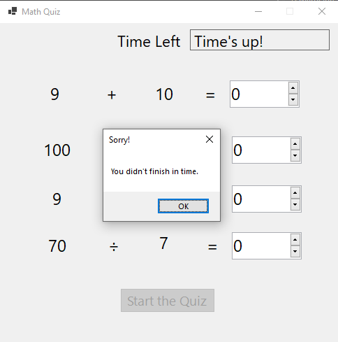
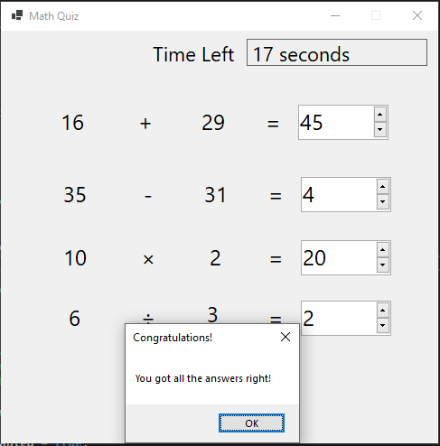

# Windows Forms using .NET and C#

|  |  |
  |:--:|:--:|
  | Time's up | Completed Quiz |

This [tutorial](https://learn.microsoft.com/en-us/visualstudio/get-started/csharp/tutorial-windows-forms-math-quiz-create-project-add-controls?view=vs-2022) was followed to get an insight into how to make an application using Windows Forms App (.NET Framework) and C# programming.

Apart from the tutorial, using previous C# experience, sound effects were coded when a user entered the wrong answer and the correct answer respectfully.